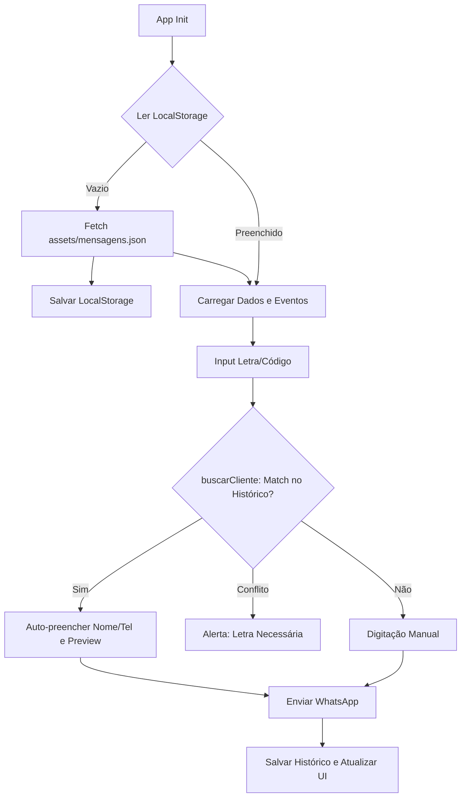

# Contexto do Projeto: Zap Entregas (MVP)

## Descrição
Aplicativo web offline-first focado em ajudar entregadores de logística a enviar mensagens padronizadas. É um MVP em Vanilla JS (HTML5/CSS3) que evoluirá para Node.js/Vite e PWA, com deploy no Netlify. Usa `localStorage` para persistência.

## Fluxo de Dados (Data Flow)

## Dicionário de Funções JS (Contexto para a IA)

### Inicialização e Configuração
- **`onload` / `adicionarEventListeners`**: Inicializam a UI e vinculam eventos (`input`, `blur`, `change`) para formatação em tempo real e salvamento automático (`entregador`, `letras`).
- **`carregarDadosIniciais`, `definirDDDPadrao`, `carregarEntregadorSalvo`, `carregarLetrasSalvo`**: Injetam valores padrão ou em cache no DOM.

### Formatação e UI
- **`ajustaNomeCliente`, `capitalizeFirstLetter`**: Higienizam e capitalizam o nome do destinatário.
- **`aplicarMascaraTelefone`**: Aplica máscara `XXXXX-XXXX` no número.
- **`formataCodigo`**: Limita o código numérico (ex: max 4 dígitos, preenche com zeros) e higieniza a letra da rota (apenas caracteres alfabéticos).
- **`atualizarPreviewMensagem`, `formatarTextoFinal`, `msgSelecionada`**: Lêem os dados preenchidos, injetam no template (ex: `{nome}`, `{empresa}`) e atualizam a caixa de preview.

### Lógica Core: Busca de Destinatário por Código
- **`onCodigoChange`**: Evento principal disparado ao digitar letras ou números. Higieniza o input, chama a busca e, se encontrar, auto-preenche o formulário.
- **`padronizarCodigo`**: Junta letra e número no formato `LETRA-NUMERO` (ex: `A-0123`).
- **`buscarCliente`**: Lê o `localStorage`. Filtra as chaves procurando as que **terminam** com o código numérico digitado. 
  - *Comportamento:* Se achar apenas `1` match, retorna o objeto do cliente. Se achar `> 1` match (ex: `A-0123` e `B-0123` salvos, e o usuário digitou só `0123`), aciona `alertaConflitoCodigo()`.
- **`preencherDadosCliente`**: Popula os inputs de nome e telefone com os dados encontrados e recarrega o preview.
- **`alertaConflitoCodigo` / `limpaAlertaCodigoDuplicado`**: Gerenciam o estado de erro visual na UI (borda vermelha e texto de aviso).

### Submissão e Persistência
- **`enviarWhatsApp`**: Valida obrigatoriedade de campos, monta a URL `wa.me`, abre a aba do WhatsApp, salva os dados e limpa o form.
- **`salvarDadosCliente`**: Grava no `localStorage` o nome, telefone e o array de `msgEnviadas` usando `LETRA-NUMERO` como chave.
- **`limpaFormDestinatario`, `limparHistoricoClientes`**: Resets de estado da UI e do banco local.

## Features Futuras (Roadmap)
1. **Edição de Mensagens**: Carregar `mensagens.json` via `fetch`, permitir edição em modal e salvar no `localStorage`.
2. **Reordenação Inteligente do Select**: Cruzar o array `msgEnviadas` salvo no cliente com a lista de options. Mensagens já enviadas vão para o fim da lista e o app seleciona o próximo ID lógico automaticamente.

## Restriçoes 
- **IMPORTANTE** **NAO** execute comandos git
- **NAO** inclua comentarios desnecessarios no código 
- **USE** nomes claros e objetivos em classes, funcoes, variaveis, etc;
